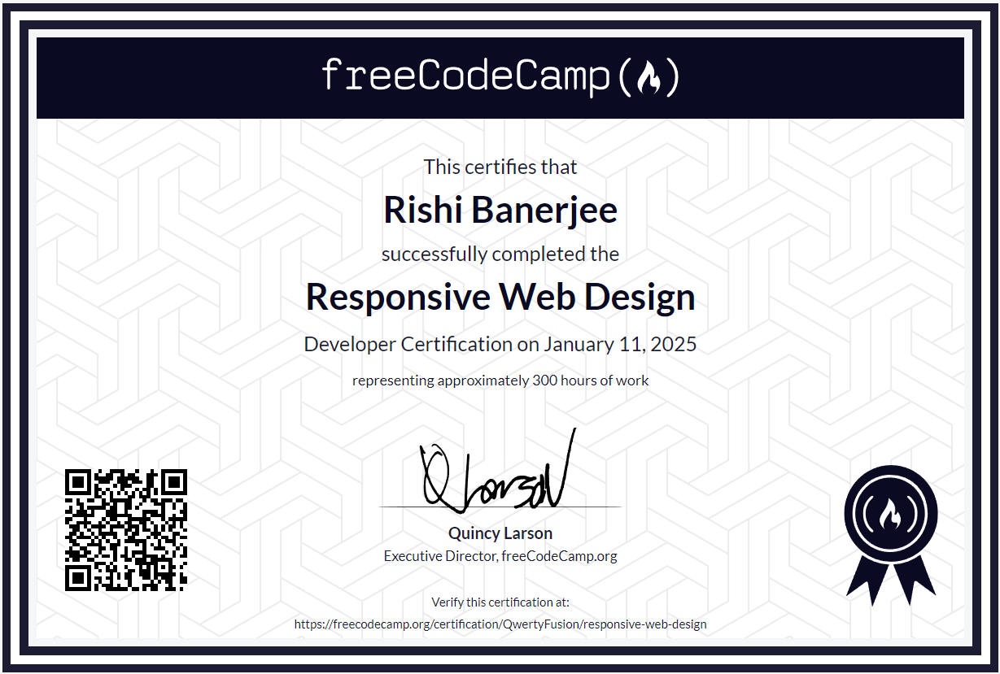

<h1>Free Code Camp - Responsive Web Design Solution</h1>
 

  

  <h3><a href="https://www.freecodecamp.org/learn/2022/responsive-web-design">Course Link</a></h3>

<h2>Certificate</h2>

  

  <h3><a href="https://www.freecodecamp.org/certification/QwertyFusion/responsive-web-design">Certificate Link</a></h3>

<h2>Contents</h2>

| Assignment                                                                                                                                                                      | Solution                                    |
| ------------------------------------------------------------------------------------------------------------------------------------------------------------------------------- | ------------------------------------------- |
| [Survey Form](https://www.freecodecamp.org/learn/2022/responsive-web-design/build-a-survey-form-project/build-a-survey-form)                                                    | [Click here](./survey-form/)                |
| [Tribute Page](https://www.freecodecamp.org/learn/2022/responsive-web-design/build-a-tribute-page-project/build-a-tribute-page)                                                 | [Click here](./tribute-page/)               |
| [Technical Documentation Page](https://www.freecodecamp.org/learn/2022/responsive-web-design/build-a-technical-documentation-page-project/build-a-technical-documentation-page) | [Click here](./technical-document-page/)    |
| [Product Landing Page](https://www.freecodecamp.org/learn/2022/responsive-web-design/build-a-product-landing-page-project/build-a-product-landing-page)                         | [Click here](./product-landing-page/)       |
| [Personal Portfolio Webpage](https://www.freecodecamp.org/learn/2022/responsive-web-design/build-a-personal-portfolio-webpage-project/build-a-personal-portfolio-webpage)       | [Click here](./personal-portfolio-webpage/) |

<h2>Tools used</h2>
<ol>
  <li>Visual Studio Code</li>
  <li>HTML</li>
  <li>CSS</li>
  <li>JavaScript</li>
</ol>

<h2>Link to Tools</h2>

  &emsp;
  &emsp;
  &emsp;
  &emsp;

<h2>Developer</h2>
<ul>
  <li><a href="https://github.com/QwertyFusion">[@QwertyFusion]</a></li>
</ul>
